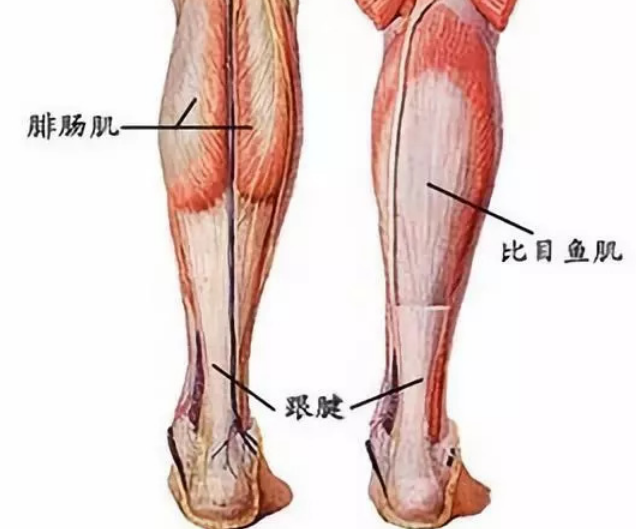
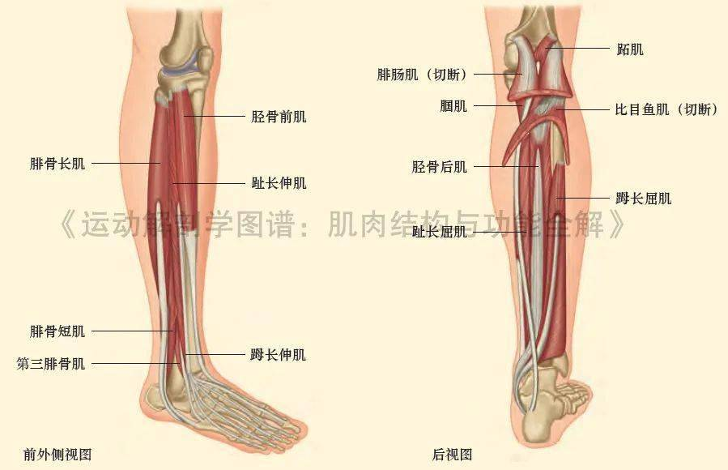

## 引言

相信很多人都想要一双腿型好的腿，所以本篇文章就来分析多种腿部问题并且针对多种问题提供详细的分析和教程。相信大家之前也在网上社交媒体平台看过一堆的教程，然后跟着练但很少有用，甚至越来越粗，那很可能就是教程并不适合你这种腿型，要根据腿型分析制定计划。

## 肌肉型腿

### 概述

肌肉型腿（常被说成“小腿很壮、线条硬”）一般不是单一原因造成的，而是**用力方式 + 生活习惯 + 体态结构**长期叠加的结果。简单说：**腿部肌肉被反复、高频地“用错力”**，就容易变成肌肉型。

### 如何判断自己是否是肌肉型腿？

- 放松坐着时：小腿硬、轮廓明显
- 一踮脚：肌肉立刻鼓起、形状清晰
- 按压感觉紧绷、有弹性（不是软软的）

✔️ 符合这些，多半是肌肉主导型。

### 具体是如何形成的？

#### 1️⃣ 用小腿“代偿发力”

很多人走路、站立、运动时，本该用臀部和大腿，结果却习惯性用小腿顶上：

- 走路时脚尖先落地
- 站着时一直绷着小腿
- 上下楼、跑步、跳跃靠踮脚完成

👉 小腿长期高频收缩 → 肌肉变粗、变硬。

#### 2️⃣ 长时间站立或久坐不动

- 久站：小腿持续紧张维持身体
- 久坐：小腿循环差 + 一站起来就猛发力

这两种都会让小腿肌肉越来越紧、越来越“实”。

#### 3️⃣ 运动方式不当

容易练出肌肉型腿的情况包括：

- 跳绳、波比跳、冲刺跑（不拉伸）
- 爬楼梯、登山
- 负重深蹲但姿势不对
- 只练腿、不放松

⚠️ 不是运动本身的问题，是「发力 + 拉伸」没做好。

#### 4️⃣ 鞋子和姿势问题

- 高跟鞋 / 厚底鞋
- 常穿硬底、不缓震的鞋
- 内八 / 外八 / 骨盆前倾

这些都会改变受力点，让小腿被迫多干活。

#### 5️⃣ 体态 + 遗传

- 腓肠肌天生位置偏低
- 跟腱较短
- 小腿肌肉形态偏外扩

👉 这类人稍微一练就显腿壮，但并不是“没救”。

### 解决方法

其实解决方法没有大家想的那么难。

只需要做到以下三点：
1. 停止“错误用力”
2. 系统性放松拉伸
3. 重建走路/站立方式

:::error
千万不要不吃饭或者疯狂拉伸。
:::

#### 1️⃣ 停止“错误用力”

造成这个最大的原因就是走路姿势，用小腿发力，走路应该是臀部和大腿发力，而不是小腿。

千万不要用脚尖着地，不要垫脚走路，这样会越来越粗（尖叫）！！！

也千万不要久站锁死膝盖，这样都会导致小腿过度发力，最后造成肌肉腿。

跑步等运动的时候不要只靠小腿支撑。

刚开始肯定会不习惯的，习惯了就好了，一个好习惯真的很重要（尖叫）！！！

**🙅 并且尽量在小腿软下来之前暂时少做跳跃性运动**

#### 2️⃣ 拉伸运动

做完运动一定要拉伸，不然包会越来越粗的（尖叫）！！！

不拉伸的垃圾桶一位（）

动作 A｜直腿拉伸（腓肠肌）：

- 面对墙，后腿伸直、脚跟踩实
- 感觉到小腿后侧拉长
- 30 秒 × 3 组

动作 B｜弯腿拉伸（比目鱼肌）

- 后腿微弯、脚跟不离地
- 拉的是靠近脚踝那一段
- 30 秒 × 3 组

酸是正常的，动作最好越慢越好。

#### 3️⃣ 改善走路姿势

✅ 正确走路发力（重点）:

> 脚跟落地 → 脚掌滚动 → 脚趾离地

- 走路时注意：臀部带腿，不是小腿推你
- 小腿感觉应该是“顺带用”，不是“主力”

:::warning
建议穿平底鞋，不要穿高跟鞋之类的。
:::

### 总结

就一句话：

> 肌肉型腿不是“瘦不下来”，而是“需要被放过”。

:::info
未完待续~
:::
